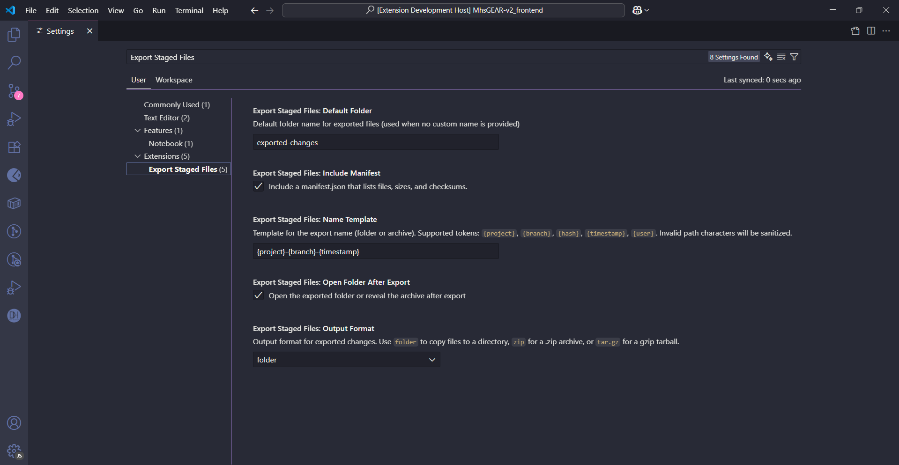

# Export Staged Files - VS Code Extension

## Giới thiệu

Extension này giúp bạn xuất (export) các file đã thay đổi trong dự án Git (bao gồm: staged, modified, untracked) ra một thư mục riêng biệt, thuận tiện cho việc review, chia sẻ hoặc backup.

## Tính năng

- ✅ Xuất tất cả các file đã thay đổi (staged, modified, untracked) trong workspace hiện tại
- ✅ Tùy chọn tên thư mục xuất tùy ý
- ✅ Giữ nguyên cấu trúc thư mục gốc khi export
- ✅ Hỗ trợ định dạng đầu ra: folder, .zip, .tar.gz
- ✅ Template đặt tên xuất: `{project}-{branch}-{timestamp}` (tùy biến)
- ✅ Tạo `manifest.json` chứa thông tin chi tiết + checksum SHA-256 (bật/tắt được)
- ✅ Tự động mở thư mục/hiển thị file sau khi export
- ✅ Hiển thị progress trong quá trình export

## Yêu cầu hệ thống

- VS Code phiên bản 1.74.0 trở lên
- Workspace phải là Git repository
- Git đã được cài đặt và cấu hình

## Cách cài đặt

1. Mở VS Code
2. Vào Extensions (Ctrl+Shift+X)
3. Tìm kiếm "Export Staged Files"
4. Nhấn Install

## Cách sử dụng

### 1. Export với tên thư mục mặc định

1. Mở Command Palette (`Ctrl+Shift+P`)
2. Tìm và chọn: **`Export Staged Files: Export Changed Files`**
3. Chọn nơi lưu thư mục export
4. Extension sẽ xuất các file thay đổi vào thư mục có tên trùng với tên project

### 2. Export với tên thư mục tùy chỉnh

1. Mở Command Palette (`Ctrl+Shift+P`)
2. Tìm và chọn: **`Export Staged Files: Export With Custom Folder Name`**
3. Nhập tên thư mục mong muốn
4. Chọn nơi lưu thư mục export

### 3. Kết quả sau khi export

- ✨ Các file thay đổi được copy vào thư mục hoặc đóng gói thành archive (.zip/.tar.gz)
- 📋 File `manifest.json` (nếu bật) chứa thông tin chi tiết và checksum:
  ```json
  {
    "name": "myapp-main-20250902-102030",
    "projectName": "myapp",
    "branch": "main",
    "commitHash": "a1b2c3d",
    "user": "Your Name",
    "exportDate": "2025-09-02T10:20:30.000Z",
    "totalFiles": 5,
    "stagedFiles": 2,
    "modifiedFiles": 2,
    "untrackedFiles": 1,
    "files": [
      { "path": "src/file1.ts", "size": 123, "sha256": "..." },
      { "path": "README.md", "size": 456, "sha256": "..." }
    ]
  }
  ```
- 📂 Thư mục export được mở hoặc file archive được hiển thị trong Explorer

## Các loại file được export

Extension sẽ export các file thuộc các trạng thái sau:

- **Staged files**: Files đã được `git add`
- **Modified files**: Files đã được chỉnh sửa nhưng chưa staged
- **Untracked files**: Files mới tạo chưa được Git theo dõi

## Commands có sẵn

| Command                                    | Mô tả                            |
| ------------------------------------------ | -------------------------------- |
| `exportStagedFiles.export`                 | Export với tên thư mục mặc định  |
| `exportStagedFiles.exportWithCustomFolder` | Export với tên thư mục tùy chỉnh |

## Cấu hình

- `exportStagedFiles.outputFormat`: `folder` | `zip` | `tar.gz` (mặc định: `folder`)
- `exportStagedFiles.nameTemplate`: Template đặt tên. Token hỗ trợ:
  - `{project}`: tên project (thư mục workspace)
  - `{branch}`: tên nhánh Git hiện tại
  - `{hash}`: commit hash rút gọn
  - `{timestamp}`: dạng `YYYYMMDD-HHmmss`
  - `{user}`: Git user.name
    (ký tự không hợp lệ trong đường dẫn sẽ được thay bằng '-')
- `exportStagedFiles.includeManifest`: Bật/tắt tạo `manifest.json` (mặc định: true)

Ảnh minh họa phần cài đặt:



## Lưu ý quan trọng

- ⚠️ Extension chỉ hoạt động trong workspace có sử dụng Git
- ⚠️ Các file export là bản hiện tại trên máy, không phải nội dung trong commit
- ⚠️ Nếu thư mục export đã tồn tại, nó sẽ bị ghi đè
- ⚠️ Chỉ copy các file thực sự tồn tại và là file (không copy thư mục rỗng)

## Troubleshooting

### "No workspace folder found"

- Đảm bảo bạn đã mở một folder/workspace trong VS Code

### "No changed files found"

- Kiểm tra xem có file nào thay đổi trong Git không
- Chạy `git status` để xem trạng thái hiện tại

### Extension không hoạt động

- Đảm bảo Git đã được cài đặt và workspace là Git repository
- Thử restart VS Code

## Đóng góp

Nếu bạn muốn đóng góp cho dự án:

1. Fork repository này
2. Tạo branch mới cho tính năng
3. Commit các thay đổi
4. Tạo Pull Request

## Báo cáo lỗi

Nếu phát hiện lỗi hoặc có ý kiến đóng góp, vui lòng tạo issue tại: [GitHub Issues](https://github.com/quanghuybest2k2/export-staged-files/issues)

## License

Dự án này được phát hành dưới giấy phép MIT.

---

**Developed with ❤️ by quanghuybest2k2**
